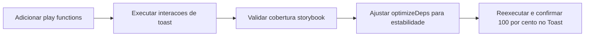

# FE-05 - Aumento de cobertura via Storybook para Toast

## Contexto e objetivo

Atender solicitacao de cobertura via Storybook para o componente Toast, cobrindo interacoes de dismiss manual e fallback com auto-dismiss.

## Escopo tecnico e arquivos modificados

- `src/presentation/design-system/components/Feedback/Feedback.stories.tsx`
- `vite.config.ts`

## Decisao arquitetural (ADR resumido)

### Decisao

Adicionar `play` functions em stories de Feedback para validar fluxos reais do Toast no projeto Storybook (interactions test), incluindo:

- disparo de notificacao;
- fechamento manual;
- fallback de parametros e remocao por timeout.

### Alternativas avaliadas

- Depender apenas dos testes unitarios para cobertura do Toast.
- Criar mocks artificiais no Storybook sem interacao de usuario.

### Trade-offs

- Pro:
  - Cobertura mais aderente ao uso real em Storybook.
  - Melhor confiabilidade de regressao visual + interativa.
- Contra:
  - Testes de story ficam mais lentos (espera de auto-dismiss).

## Fluxo da alteracao

## Evidencias de validacao

- Comando: `npx vitest run --project storybook --coverage`
- Resultado:
  - Test Files: `7 passed`
  - Tests: `14 passed`
  - `Toast.tsx`: `100%` statements, `100%` branches, `100%` functions, `100%` lines.

## Riscos, impacto e plano de rollback

### Riscos

- Aumento do tempo de execucao dos testes de Storybook.

### Impacto

- Positivo na qualidade e confiabilidade dos fluxos de feedback.

### Rollback

1. Reverter alteracoes em `Feedback.stories.tsx` e `vite.config.ts`.
2. Manter cobertura de Toast apenas por testes unitarios.

## Proximos passos recomendados

1. Aplicar padrao de `play` function para outros componentes com comportamento assíncrono.
2. Manter `optimizeDeps.include` alinhado com novas dependencias de Storybook interactions.
