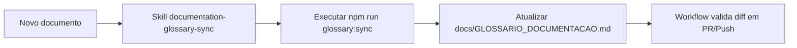

# Skill Generica para Sincronizacao de Glossario Documental

## Contexto e objetivo

Criar uma skill reutilizavel para percorrer documentacao do projeto (incluindo `docs/`, `issue/` e `review/`) e consolidar termos/siglas em um glossario em portugues, com significados, contexto de uso e links de referencia para conceitos complexos.

## Escopo tecnico e arquivos modificados

- `.github/skills/documentation-glossary-sync/SKILL.md`
- `tools/documentation-glossary/generate-glossary.mjs`
- `.github/workflows/documentation-glossary-sync.yml`
- `.github/copilot-instructions.md`
- `package.json`
- `docs/GLOSSARIO_DOCUMENTACAO.md`

## Decisao arquitetural (ADR resumido)

### Decisao

Adotar uma abordagem hibrida:

1. Skill generica para orientar uso pelo agente.
2. Script Node reutilizavel para geracao do glossario documental.
3. Workflow CI para enforcement automatico quando houver novos documentos/alteracoes.

### Alternativas avaliadas

- Atualizacao manual do glossario sem automacao.
- Criar glossario estatico sem referencias de origem.

### Trade-offs

- Pro:
  - Padroniza governanca documental.
  - Reduz risco de glossario desatualizado.
  - Reutilizavel em outros repositórios com minimo ajuste.
- Contra:
  - Exige manutencao do dicionario base de termos.
  - PDFs nao pesquisaveis dependem de OCR previo.

## Fluxo da alteracao

## Evidencias de validacao

- Comando executado: `npm run glossary:sync`
- Resultado: arquivo `docs/GLOSSARIO_DOCUMENTACAO.md` gerado/atualizado com termos, significados, uso e referencias.
- Validacao CI preparada em `.github/workflows/documentation-glossary-sync.yml`.

## Riscos, impacto e plano de rollback

### Riscos

- Falsos positivos em extração de termos por heuristica.
- Necessidade de curadoria periodica de definicoes.

### Impacto

- Melhora rastreabilidade de linguagem e consistencia documental do projeto.

### Rollback

1. Reverter commit dos arquivos da skill/script/workflow.
2. Restaurar versao anterior do glossario documental, se necessario.

## Proximos passos recomendados

1. Evoluir dicionario base com termos especificos de dominio.
2. Adicionar teste automatizado do gerador para validar formato de saida.
