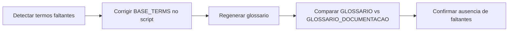

# Correcao de Cobertura de Termos no Glossario Documental

## Contexto e objetivo

Corrigir a geracao de `docs/GLOSSARIO_DOCUMENTACAO.md` para garantir cobertura completa dos termos existentes em `docs/GLOSSARIO.md`.

## Escopo tecnico e arquivos modificados

- `tools/documentation-glossary/generate-glossary.mjs`
- `docs/GLOSSARIO_DOCUMENTACAO.md`

## Decisao arquitetural (ADR resumido)

### Decisao

Manter o dicionario base de termos como fonte principal e garantir que cada termo seja uma chave de primeiro nivel no objeto `BASE_TERMS`.

### Alternativas avaliadas

- Continuar com extracao apenas por ocorrencia textual.
- Criar whitelist externa sem alteracao do script.

### Trade-offs

- Pro:
  - Garante presenca de termos obrigatorios mesmo com baixa frequencia textual.
  - Evita regressao de cobertura entre glossarios.
- Contra:
  - Exige cuidado em manutencao da estrutura do objeto base.

## Fluxo da alteracao

## Evidencias de validacao

- Comando executado: `npm run glossary:sync`
- Validacao de cobertura cruzada: comparacao automatizada entre termos de `docs/GLOSSARIO.md` e `docs/GLOSSARIO_DOCUMENTACAO.md`.
- Resultado final: nenhum termo faltante.

## Riscos, impacto e plano de rollback

### Riscos

- Baixo risco funcional; mudanca restrita a documentacao/automacao.

### Impacto

- Cobertura completa de termos entre glossarios.
- Melhoria na confiabilidade do processo automatico.

### Rollback

1. Reverter alteracoes no script gerador.
2. Regenerar o glossario para retornar ao estado anterior.

## Proximos passos recomendados

1. Adicionar teste automatizado de consistencia entre os dois glossarios no CI.
2. Incluir validacao estrutural do objeto `BASE_TERMS` para prevenir insercoes aninhadas acidentais.
